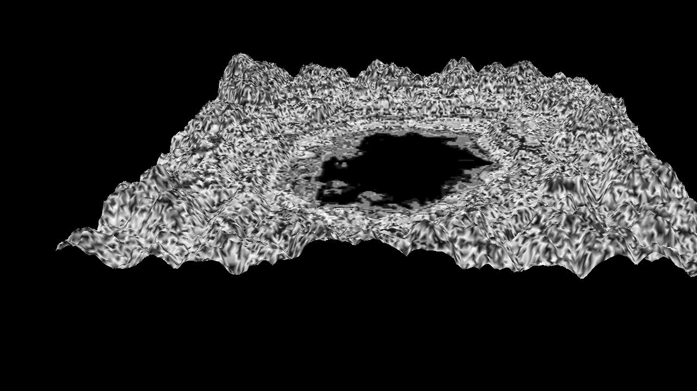
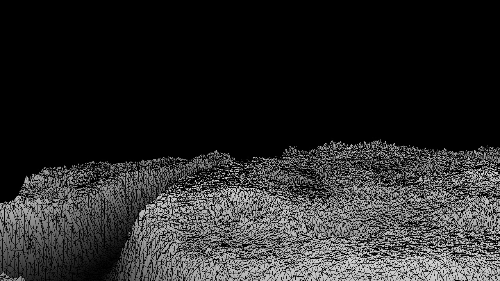
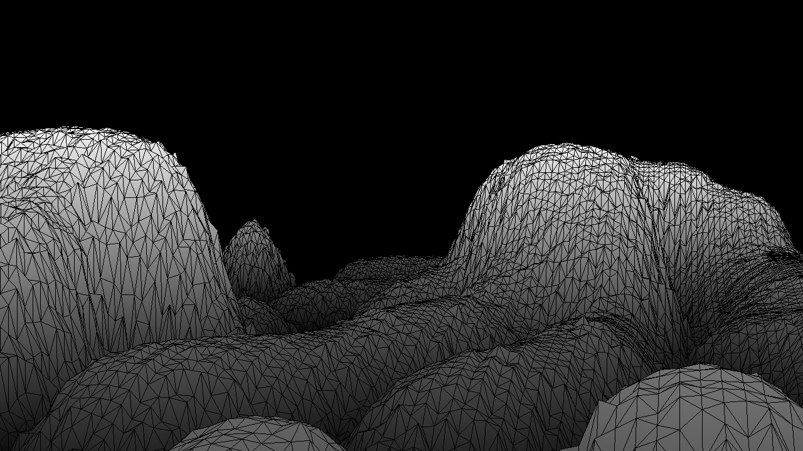
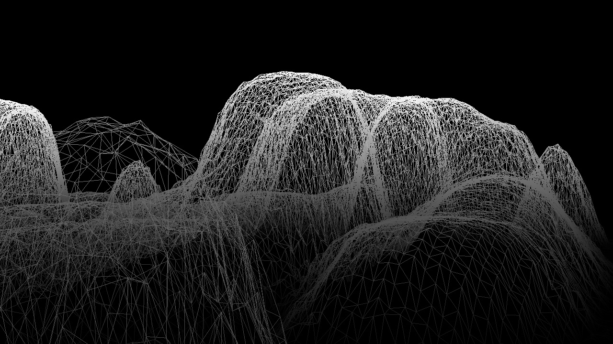
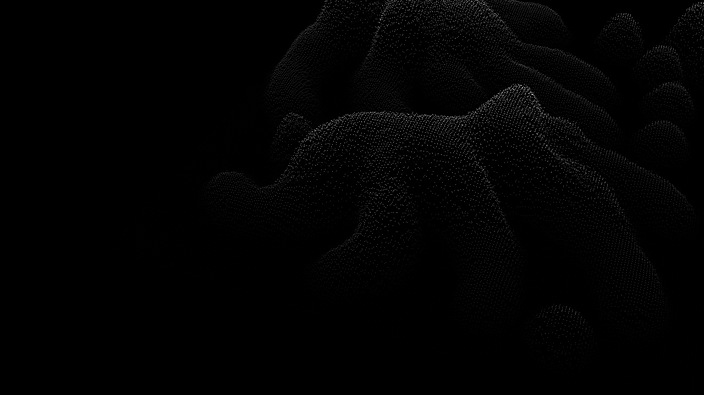
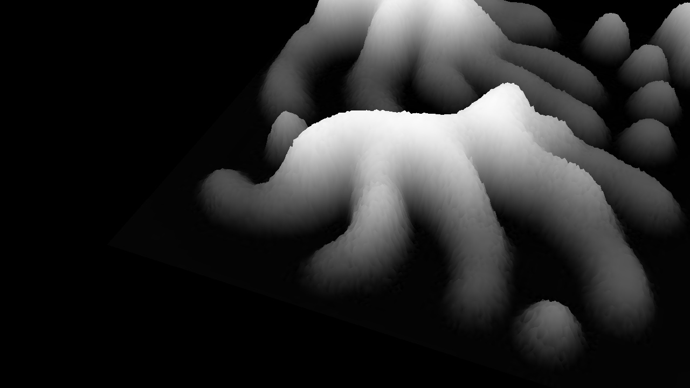

# Heightmap
Load solution in Visual Studio an build project

## To run
- cd to ./Bin/Debug
- ```./hw1.exe "../../heightmap/image-to-run.jpg"```
- Note: convert image to grayscale first and this generally runs better with 256x256

## To use
- after running, there are 6 modes using numbers 1-6
1. points
2. lines
3. triangles
4. smooth. In this mode, you can press ```0```, ```9```, ```-```, and ```+``` as well
5. pattern. I just generated random grayscale shade at each vertex.
6. wireframe on top of triangles.

# Mouse control
- use ctrl, shift, or mouse movement to translate, scale or rotate

# Examples





